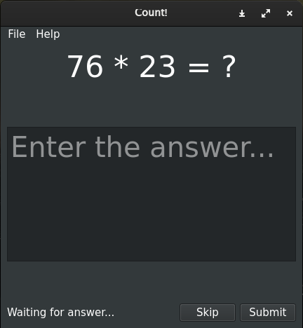
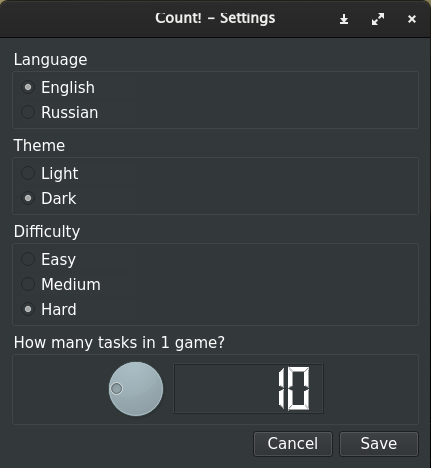
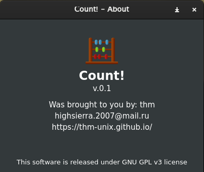

# Count!

A simple software to train mental count

## Description
This is a Python application which can help you to train your mental count skills. It has 3 levels of difficulty.

## Installation
1. Install Python 3
2. <pre class="hljs" style="display: block; overflow-x: auto; padding: 0.5em; background: rgb(240, 240, 240) none repeat scroll 0% 0%; color: rgb(68, 68, 68);">pip3 install PyQt5</pre>
3. Clone this repository & cd into it
4. <pre class="hljs" style="display: block; overflow-x: auto; padding: 0.5em; background: rgb(240, 240, 240) none repeat scroll 0% 0%; color: rgb(68, 68, 68);">chmod +x ./main.py</pre>
5. Specify your path to the main.py in count.desktop
6. <pre class="hljs" style="display: block; overflow-x: auto; padding: 0.5em; background: rgb(240, 240, 240) none repeat scroll 0% 0%; color: rgb(68, 68, 68);">sudo cp count.desktop /usr/share/applications/</pre>

## Localization
<b>English: </b> 100% (by <a href="https://github.com/thm-unix/">thm-unix</a>)   
<b>Russian: </b> 100% (by <a href="https://github.com/thm-unix/">thm-unix</a>)   
(here can be your locale)

## Screenshots

